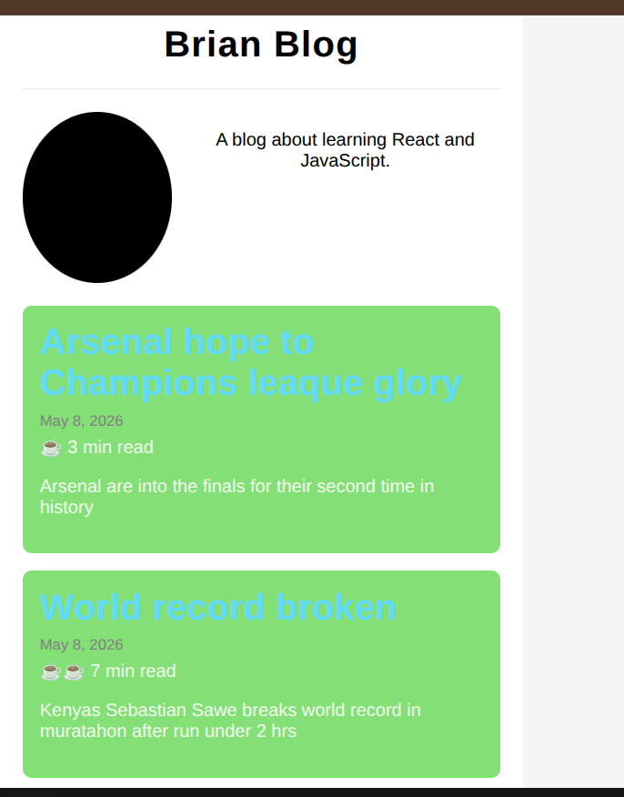

# 🧑‍💻 Personal Blog (React Components & Props Lab)

This is a simple personal blog project built using React. It demonstrates how to use components, props, and lists to build a static website.

---

##  Features

- Reusable React components
- Props for dynamic content
- Rendering lists using `.map()`
- Default prop values
- Simple blog layout (Header, About, Articles)
- Bonus reading time feature 

---

##  Project Structure

src/
│── components/
│   ├── App.jsx
│   ├── App.css
│   ├── Header.jsx
│   ├── About.jsx
│   ├── ArticleList.jsx
│   ├── Article.jsx
│── data/
│   └── blog.js

---

##  How to Run the Project

1. Install dependencies:
npm install

2. Start the development server:
npm run dev

3. Open in your browser:
http://localhost:5173

---

##  Screenshots

---

## Key Concepts Learned

- React components
- Props and data flow
- Default props
- List rendering using map()
- Component hierarchy

---

## Code Comments Summary

Home.jsx (App.jsx):
- Receives blog data and passes it to child components using props
- Acts as the main parent component

About.jsx:
- Displays blog image and description
- Uses default image if none is provided via props

Links.jsx (if used):
- Displays navigation links for the blog
- Helps structure page navigation

ArticleList.jsx:
- Receives posts array
- Uses .map() to render multiple Article components

Article.jsx:
- Displays individual blog post details
- Shows title, date (with default), preview, and reading time

---

## Author

Brian Mutai